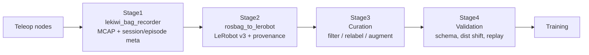

# LeKiwi データパイプライン設計

このドキュメントは、LeKiwi ロボットの模倣学習用データを **収集 → フォーマッティング → キュレーション → 検証** の 4 ステージで扱うためのアーキテクチャ、責務分離、実装方針、使い方をまとめたものです。

キュレーションと検証は今後追加する後工程で、本ドキュメントでは章だけ確保し、具体スペックは順次埋めていきます。

---

## 目次

1. [設計原則](#1-設計原則)
2. [パイプライン全体像](#2-パイプライン全体像)
3. [ステージ 1: 収集 (Recording)](#3-ステージ-1-収集-recording)
4. [ステージ 2: フォーマッティング (Formatting)](#4-ステージ-2-フォーマッティング-formatting)
5. [ステージ 3: キュレーション (Curation) — 予定](#5-ステージ-3-キュレーション-curation--予定)
6. [ステージ 4: 検証 (Validation) — 予定](#6-ステージ-4-検証-validation--予定)
7. [メタデータ / プロヴェナンス設計](#7-メタデータ--プロヴェナンス設計)
8. [ディレクトリレイアウト](#8-ディレクトリレイアウト)
9. [使い方チートシート](#9-使い方チートシート)
10. [トラブルシューティング](#10-トラブルシューティング)

---

## 1. 設計原則

- **Raw first, format later**: リアルタイム側は取りこぼしゼロを最優先し、生データ (`ros2 bag record`, MCAP) を保存する。時刻同期・特徴量定義・エンコード方式・正規化は後工程でいくらでも作り直す。
- **単一の Signal Spec**: 単位、座標系、absolute/relative、gripper 表現、前処理有無を [lekiwi_metadata.py](../lekiwi_ros2_teleop/lekiwi_metadata.py) 内の `build_signal_spec()` に一元化し、収集・変換の両方から参照する。SIGNAL_SPEC_VERSION が破壊的変更のトリガ。
- **プロヴェナンス必須**: どの生 bag から、どのコード commit で、どんなパラメータで生成された dataset かを常に辿れるようにする（[§7](#7-メタデータ--プロヴェナンス設計)）。
- **info.json は汚さない**: LeRobot 標準 `meta/info.json` には独自情報を単一トップレベルキー `x_lekiwi` にまとめてのみ注入する。詳細は `provenance/` サブディレクトリに置く。
- **決定性**: 同じ raw + 同じメタ + 同じコード → 同じ dataset。乱数を使う工程では seed を必ずメタに残す。
- **後段の変更が前段を壊さない**: 各ステージの成果物は次のステージの読み取り専用入力とみなす。

---

## 2. パイプライン全体像



| ステージ | 入力 | 出力 | 主な責務 |
|---|---|---|---|
| 1. 収集 | ROS2 トピック | MCAP bag + `session.yaml` + `episode.yaml` + `software.json` | raw を落とさず、環境・機材・コード状態を記録 |
| 2. フォーマッティング | Stage 1 のセッション | LeRobot Dataset v3 + `provenance/` | 時刻同期、特徴量定義、動画エンコード、プロヴェナンス生成 |
| 3. キュレーション | Stage 2 の dataset | 別 repo_id の dataset + キュレーション記録 | エピソード選別、ラベル修正、拡張、split 割当（**予定**） |
| 4. 検証 | Stage 3 の dataset | 検証レポート | スキーマ/分布/リプレイ整合性チェック（**予定**） |

---

## 3. ステージ 1: 収集 (Recording)

### 3.1 責務

- ROS2 テレオペのトピックを **CompressedImage のまま** MCAP に書く。動画エンコード等はしない。
- エピソード境界（1 bag = 1 episode）を明確化。
- 収集時の環境情報とコード状態を保存し、後段が完全に再構築できるようにする。

### 3.2 実装

- ノード: [lekiwi_bag_recorder.py](../lekiwi_ros2_teleop/lekiwi_bag_recorder.py) (`ros2 run lekiwi_ros2_teleop lekiwi_bag_recorder`)
- Launch: [lekiwi_bag_record.launch.py](../launch/lekiwi_bag_record.launch.py)
- 内部で `ros2 bag record -s mcap -o <ep_dir>/bag <topics...>` を subprocess 起動し、`stop_episode` サービスで SIGINT を送って正常終了させる。

### 3.3 記録するトピック（デフォルト）

- `/lekiwi/joint_states`
- `/lekiwi/cmd_vel`
- `/lekiwi/arm_joint_commands`
- `/lekiwi/camera/front/image_raw/compressed`
- `/lekiwi/camera/wrist/image_raw/compressed`

タイムスタンプは各メッセージの `header.stamp` を第一に、無い場合は bag 受信時刻をフォールバックとして使う。

### 3.4 サービス

| サービス | 型 | 挙動 |
|---|---|---|
| `~/start_episode` | `std_srvs/Trigger` | 新しい `episode_XXXXXX/` を作り bag 録画を開始 |
| `~/stop_episode` | `std_srvs/Trigger` | bag を finalize、`bag_sha256` を計算、`episode.yaml` を更新 |

### 3.5 前提: マシン間クロック同期の確認

LeKiwi 本体・リーダーアーム側 PC・記録用ホストなど **複数マシンにまたがってテレオペする場合**、各トピックの `header.stamp` は発行元マシンのクロックで打たれる。クロックがズレていると Stage 2 の最近傍同期が構造的にズレ、`analyze` の gap 分布に実際より大きな値が出る（あるいは、見かけ上揃っているのに物理的には別時刻のデータを対にしてしまう）。

そのため **収集を始める前に必ず NTP/PTP 同期を確認する**。chrony を使う場合は各マシンで:

```bash
# 同期ソースと到達状況を確認
chronyc sources -v

# 自マシンのシステムクロックが基準からどれだけズレているか
chronyc tracking
```

確認ポイント:

- `chronyc sources` の各行の先頭が `^*`（現在同期中のソース）になっているか。`^?` のままなら未到達、`^+` は候補で未採用。
- `chronyc tracking` の `System time` / `Last offset` / `RMS offset` が **同期許容幅 `--sync-tolerance-ms`（通常 20ms 前後）より十分小さい**こと。ミリ秒オーダに収まっていれば問題ない。秒オーダのズレがある場合はそのまま収集しない。

まだ chrony が入っていない / 同期していない場合のみセットアップする（**既に同期できていれば何もしなくてよい**）:

```bash
# 未導入のときだけ
sudo apt install chrony
sudo systemctl enable --now chrony

# 全マシンを同一 NTP サーバ（LAN 内なら 1 台を基準サーバにしてもよい）に向け、
# 数十秒後に再度 chronyc sources で ^* が付くことを確認する
```

> 複数マシン間の相対オフセットを直接見たい場合は、各マシンで `chronyc tracking` の `Last offset` を突き合わせるか、基準マシンに対して `chronyc sourcestats` を確認する。LAN 内で高精度が必要なら PTP（`linuxptp` / `ptp4l`）も選択肢。

### 3.6 前提: MCAP ストレージプラグイン

```bash
sudo apt install ros-jazzy-rosbag2-storage-mcap
```

### 3.7 基本コマンド

```bash
ros2 launch lekiwi_ros2_teleop lekiwi_bag_record.launch.py \
    launch_teleop:=false \
    output_root:=$HOME/lekiwi_bags \
    single_task:="Pick and place the bottle cap" \
    target_fps:=30 \
    operator:="inoma" \
    location:="lab_A" \
    note:="lighting: overhead LED, run 3" \
    front_camera_id:="realsense_D435_serial123" \
    wrist_camera_id:="usbcam_v2_serial456" \
    arm_calibration_file:="$HOME/.lekiwi/leader_arm.json"
```

```bash
ros2 service call /lekiwi_bag_recorder/start_episode std_srvs/srv/Trigger
# ... テレオペ実演 ...
ros2 service call /lekiwi_bag_recorder/stop_episode  std_srvs/srv/Trigger
```

#### 既存セッションへの追記録画（途中から別エピソードを足す）

レコーダを一度落としても、**同じ `session_name` を明示して再起動すれば**、既存の `episode_XXXXXX/` の続き番号から追加録画できる（`_detect_next_episode_index()` が既存の最大 index + 1 を自動採用する）。

```bash
# 既存セッションに続けて録画する（session_name を必ず明示）
ros2 launch lekiwi_ros2_teleop lekiwi_bag_record.launch.py \
    launch_teleop:=false \
    output_root:=$HOME/lekiwi_bags \
    session_name:=session_20260924_120000 \
    single_task:="Pick and place the bottle cap"
```

ポイント:

- **`session_name` を省略すると起動時刻から新しいセッション名が生成される**ため、同一ディレクトリに追記したい場合は必ず既存名を渡す。
- 再起動時に既存 `session.yaml` があれば、その **`session_uuid` / `created_at` を引き継ぐ**（各 `episode.yaml` の `session_uuid` と整合する）。`updated_at` が追記時刻に更新される。
- `single_task` / `robot_type` / `target_fps` / `topics` が前回と変わっている場合は警告を出す（新しい値で上書きして続行する）。意図しない取り違えに気付けるようにするため。

#### 失敗エピソードの削除と、削除後の追記録画・変換

各エピソードは `episode_XXXXXX/`（`bag/` と `episode.yaml`）で**完全に自己完結**しており、相互参照は無い。失敗した実演はディレクトリごと削除してよく、他エピソードには影響しない。

```bash
# 失敗エピソードを丸ごと削除
rm -rf $HOME/lekiwi_bags/session_20260924_120000/episode_000002
```

削除後に追記録画・`convert` しても問題ない。理由と番号の挙動:

- **convert は連番を要求しない**。[rosbag_to_lerobot.py](../lekiwi_ros2_teleop/rosbag_to_lerobot.py) の `_find_episodes()` は `episode_*` をソートして拾うだけで、番号が飛んでいても（例 `000000, 000001, 000003`）そのまま処理する。`bag/` が無い / 空の bag は `[skip]` で飛ばす。**出力側の `episode_index` は LeRobot が 0 から振り直す**ため、欠番は詰められて連番になる。
- **追記録画の次番号は「残っている最大番号 + 1」**（`_detect_next_episode_index()`）。
  - 末尾を削除（例 `000003`）してから録画 → 次は再び `000003`（空き番号を再利用、衝突なし）。
  - 中間を削除（例 `000001` を消して `000003` は残す）してから録画 → 次は `000004`（`000001` は欠番のまま）。いずれも convert は穴を無視するので実害なし。
- レコーダを強制終了した等で `episode.yaml` に `stop_time` / `bag_sha256` が無い bag でも、`bag/` が読めれば convert は変換を試みる。壊れている疑いがあるものは convert 前に削除しておくのが安全。

### 3.8 既知の制約と今後の改善（収集レート）

**現状（2026-10 時点）: カメラは実効 15Hz で運用する。**

計測で判明した事実:

- `control_frequency=30.0` を指定しているが、カメラ有効時は `/lekiwi/joint_states`・両カメラとも **publish 段階で ~15Hz**（`ros2 topic hz` でライブ計測、間隔 63〜69ms と非常に安定）。
- **カメラを無効化（`enable_cameras:=false`）すると `/lekiwi/joint_states` は 30Hz ちょうど**出る。
- したがって `lekiwi_bag_recorder` / QoS は無実で、律速点は **teleop ノードの制御ループ内カメラ取得経路**（Raspberry Pi の USB 帯域・CPU などハード依存を含む）。

当面の方針:

- **カメラ 15Hz を受け入れ、データセットも 15Hz に揃える**。`convert` 時は `--fps 15` を指定する（`--fps 30` にすると `timestamp = frame_index / fps` が物理時間とズレ、変換時に警告が出る）。
- 画像観測が 15Hz である以上、学習できるポリシーの実効制御周期も 15Hz が上限。固有受容感覚（joint_states）だけ 30Hz 化しても画像が追いつかないため、現時点では分離しない。

**今後の改善候補（優先度順、未着手）:**

1. **状態量とカメラの publish を別タイマー/別コールバックグループに分離**（`ReentrantCallbackGroup` + `MultiThreadedExecutor`）。カメラが 15Hz のままでも `joint_states` / action 系を 30Hz で記録でき、オフライン変換側の最近傍同期と相性が良い。
2. **カメラ取得の非同期化**: LeRobot の `OpenCVCamera` は既に背景スレッド読み出し（`read_latest()` は非ブロッキング）。それでも 15Hz に落ちる原因を切り分ける（USB 帯域競合 vs 単体デバイス上限）。`lsusb -t` で 2 台が同一 USB コントローラ配下でないか確認し、別バスへ分散する。
3. **解像度・fourcc の最適化**: 既に `fourcc="MJPG"` 設定済み。さらに解像度を下げる / 2 台のカメラ負荷を分散するなどで 30fps 到達可能か検証する。
4. 上記で 30Hz 化できた場合は、`convert` の `--fps` を 30 に戻す。
5. **`cmd_vel` を `TwistStamped` 化して header.stamp を持たせる（TODO）**。現状 `/lekiwi/cmd_vel` は `geometry_msgs/Twist` で **header を持たず**、Stage 2 では bag 受信時刻フォールバックで対にしている（計測で確認済み: 他 4 トピック `joint_states` / `arm_joint_commands` / 両カメラは header.stamp 完備、`cmd_vel` のみ header 無し）。単一マシンでは実害は小さいが、複数マシンにまたがると cmd_vel だけ時間軸が受信時刻系になり他トピック（header.stamp 系）とクロック整合が取れない。teleop 側で `TwistStamped` に切り替え、変換側の `_stamp_ns` も header 対応させる。


> 補足: Raspberry Pi などホスト側のハード制約に依存するため、ハードウェア構成（USB ハブの有無、カメラ機種）を変えた場合は再計測してこの節を更新する。

---

## 4. ステージ 2: フォーマッティング (Formatting)

### 4.1 責務

- Stage 1 の raw bag を LeRobot Dataset v3 に変換する。
- **時刻同期**を厳密に扱う（`header.stamp` ベースの最近傍/補間）。
- **同期ズレの許容幅**、**基準トピック**、**action lag** をパラメータ化。
- 変換前に「このパラメータでどれだけフレームが棄却されるか」を可視化する `analyze` モードを提供する。
- 完全なプロヴェナンス（[§7](#7-メタデータ--プロヴェナンス設計)）を生成する。

### 4.2 実装

- スクリプト: [rosbag_to_lerobot.py](../lekiwi_ros2_teleop/rosbag_to_lerobot.py)
- 実行方法: `ros2 run lekiwi_ros2_teleop lekiwi_rosbag_to_lerobot ...`
  - ament_python の entry_point は `install/<pkg>/lib/<pkg>/` に置かれ **PATH には入らない** ため、必ず `ros2 run` 経由か、または `python3 src/.../rosbag_to_lerobot.py` として直接呼ぶ。
- Signal spec は [lekiwi_metadata.py](../lekiwi_ros2_teleop/lekiwi_metadata.py) から取り込み、`meta/info.json` の `x_lekiwi.signal_spec` と `provenance/conversion.json` の両方に埋め込む。

### 4.3 モード

| モード | 説明 |
|---|---|
| `analyze` | dataset を書かず、`--tolerance-sweep-ms` の各値でどれくらい棄却されるかテーブル表示。基準トピックの実測周波数、gap 分位点も出力。**まずこれで許容幅を決める** |
| `convert` | 実際に LeRobot v3 を生成、`meta/info.json` へ `x_lekiwi` を注入、`provenance/` を書き出す |

### 4.4 同期・ペアリングパラメータ

| パラメータ | 意味 | デフォルト | 推奨 |
|---|---|---|---|
| `--sync-base-topic` | 時刻同期の基準トピック | 未指定なら observation 系で最も低周波なものを自動選択 | カメラ側（通常 30Hz） |
| `--sync-tolerance-ms` | 基準stampから他トピック最近傍までの最大許容ズレ [ms] | `20.0` | `analyze` の p95 付近。30Hz なら 15〜25 ms |
| `--action-lag-ms` | action 側 stamp に加算するオフセット [ms] | `0.0` | 0 が無難。テレオペの遅延補正には `+15〜+33 ms` |
| `--tolerance-sweep-ms` | analyze で表示するズレ許容幅の一覧 | `5 10 15 20 25 30 40 50 75 100` | 適宜変更 |
| `--trim-to-overlap` / `--no-trim-to-overlap` | 全トピックが揃って流れている区間だけに基準フレームを絞るか | `--trim-to-overlap`（ON） | 基本 ON のまま |

**action lag のデフォルトについて**: 一般的な imitation learning は「観測 obs\_t と、その瞬間の action\_t」を対で学ぶため `0` が自然です。leader arm 読み取り → 送信 → 受信の遅延が片側に偏っている場合のみ `+1/fps` (30Hz なら +33 ms) 程度で試してください。

### 4.5 overlap トリムとトピック別 gap 内訳

`analyze` / `convert` の内部では、基準トピックの各 stamp に対し他トピックの **最近傍メッセージ** を取り、「基準 stamp からの最大絶対ズレ（= そのフレームの `max_gap`）」が `--sync-tolerance-ms` を超えたフレームを棄却している。ここで 2 つの仕組みが効いている。

#### overlap トリム（`--trim-to-overlap`、デフォルト ON）

エピソードの録画は「bag 開始 → 操作開始」「操作終了 → bag 停止」の間に必ず余白ができる。この余白では joint_states・カメラは流れているのに **action 系（leader arm の `arm_joint_commands` / joy の `cmd_vel`）がまだ publish されていない / 既に止まっている**。そのままだと端の基準フレームに対する action の最近傍が数百 ms〜数秒先になり、どれだけ `--sync-tolerance-ms` を緩めても棄却され続ける（＝ drop 率が下がりきらない底）。

そこで変換・分析の前に、**全トピックが同時に流れている区間**

$$[\,\max(\text{各トピックの先頭 stamp}),\ \min(\text{各トピックの末尾 stamp})\,]$$

を計算し、基準トピックのフレームだけをこの区間に絞り込む（ペア相手のメッセージは端の最近傍探索のため全保持する）。これで端の「穴」に落ちるフレームが構造的に消え、残りは本質的な同期品質だけで評価できる。`analyze` 出力では

```
[trim] dropped 32 head + 1 tail base frames outside the all-topic overlap window
```

のように、先頭・末尾から何フレーム落としたかが表示される。無効化したい場合のみ `--no-trim-to-overlap`。

#### トピック別 gap 内訳（Per-paired-topic gap breakdown）

`max_gap` は「4 つのペア相手のうち最悪の 1 つ」なので、drop が出たときに **どのトピックが原因か** が分かると対処が早い。`analyze` は各ペア相手について gap の p50 / p95 / max と、「そのフレームで最大ズレだったのが自分だった割合（`worst%`）」を表示する。

```
--- Per-paired-topic gap breakdown (ms) ---
  topic                        |   p50 |   p95 |   max | worst%
  /lekiwi/cmd_vel              | 12.26 | 16.67 | 19.48 |  44.5%
  /lekiwi/arm_joint_commands   | 12.61 | 15.58 | 16.75 |  55.5%
  /lekiwi/camera/wrist/...     |  3.90 |  4.12 |  4.14 |   0.0%
  /lekiwi/camera/front/...     |  0.26 |  0.27 |  0.28 |   0.0%
```

- p50 は健全なのに p95 / max だけ極端に大きいトピックがあれば、そのトピックに **一時的な「穴」**（上記の端の余白や publish 詰まり）がある。
- カメラのように p50〜max すべて小さければ同期品質は良好。
- `worst%` が高いトピックが drop の主因なので、まずそこを見る（レート不足なのか、header.stamp が無く受信時刻フォールバックなのか等）。

### 4.6 タイミング可視化（`--plot`）

数値だけでは掴みにくい「トピック間の位相」「周期の揺らぎ」「同期前後の差」を 1 枚の PNG で見るためのモード。`analyze` に `--plot` を付けると、1 エピソード分の 3 段プロットを `<session-dir>/analysis_plots/timing_<episode>.png` に書き出す。

```bash
# デフォルト（最初の使用可能エピソード、0〜5s 窓）
ros2 run lekiwi_ros2_teleop lekiwi_rosbag_to_lerobot \
    --session-dir $HOME/lekiwi_bags/session_20260924_120000 \
    --mode analyze --plot

# エピソード・時間窓・保存先を指定
ros2 run lekiwi_ros2_teleop lekiwi_rosbag_to_lerobot \
    --session-dir $HOME/lekiwi_bags/session_20260924_120000 \
    --mode analyze --plot \
    --plot-episode episode_000003 \
    --plot-start-s 10 --plot-end-s 15 \
    --plot-dir /tmp/lekiwi_plots
```

| オプション | 意味 | デフォルト |
|---|---|---|
| `--plot` | タイミング図を出力する | off |
| `--plot-episode` | 対象エピソードのディレクトリ名（例 `episode_000000`） | 最初の使用可能エピソード |
| `--plot-start-s` | 図の時間窓の開始 [s]（エピソード先頭基準） | `0` |
| `--plot-end-s` | 図の時間窓の終了 [s]。負値で末尾まで | `5` |
| `--plot-dir` | 保存先ディレクトリ | `<session-dir>/analysis_plots/` |

> 収録が長いと生メッセージが密集して潰れるため、**既定では先頭 5 秒だけ**を描画する。全体や別区間を見たいときだけ `--plot-start-s` / `--plot-end-s` を指定する（`--plot-end-s -1` で全区間）。tolerance 線（赤破線）は `--sync-tolerance-ms` の値を使う。matplotlib が無い環境ではスキップして警告を出すだけで、`analyze` 本体は従来通り動く。

**図の見方（3 パネル、横軸はすべて同じ時間窓 [s]）:**

1. **Inter-message period Δt（同期前・生）**: 各トピックの隣接メッセージ間隔 [ms]。水平で安定していれば周期が綺麗（例: カメラ/joint_states は 66ms=15Hz でほぼ一定）。ギザギザ・飛びがあればそのトピックの publish が不安定（例: `cmd_vel` は joy のイベント駆動なので操作中だけ密になる）。
2. **Raw message times（同期前のラスター）**: トピックごとに生メッセージ発生時刻を縦線で表示。**緑の網掛けが「全トピックが同時に流れている overlap 窓」**（[§4.5](#45-overlap-トリムとトピック別-gap-内訳) のトリム範囲）。網掛けの左端より前で action 系の縦線が無ければ、そこが「立ち上がりの穴」。トピック間の位相ズレもここで直感的に分かる。
3. **Nearest-neighbor gap（同期後）**: トリム後の各基準フレームで選ばれた相手との gap [ms]。**赤破線の tolerance 線を全点が下回っていれば、その許容幅で棄却ゼロ**。特定トピックだけ線に張り付く/超えるなら、それが drop 主因（[§4.5](#45-overlap-トリムとトピック別-gap-内訳) の `worst%` と対応）。

要するに **パネル 1・2 が「同期前の生の素性」**、**パネル 3 が「同期後の結果」** で、同じ時間軸で上下に並ぶため前後比較ができる。

### 4.7 基本コマンド


```bash
# 1) まず analyze で許容幅を決める
ros2 run lekiwi_ros2_teleop lekiwi_rosbag_to_lerobot \
    --session-dir $HOME/lekiwi_bags/session_20260924_120000 \
    --mode analyze \
    --action-lag-ms 0

# 2) convert 実行
ros2 run lekiwi_ros2_teleop lekiwi_rosbag_to_lerobot \
    --session-dir $HOME/lekiwi_bags/session_20260924_120000 \
    --mode convert \
    --dataset-repo-id john/lekiwi_pick_place \
    --dataset-root $HOME/lerobot_datasets \
    --fps 30 \
    --sync-tolerance-ms 20 \
    --action-lag-ms 0
```

既存 dataset への追記は `--resume`。

---

## 5. ステージ 3: キュレーション (Curation) — 予定

**現時点では未実装。以下は今後の設計スケッチ。**

### 5.1 責務（案）

- 悪いエピソードの除外（人手ラベルまたは自動判定）。
- タスク文字列や success flag の付け直し（relabeling）。
- train / val / test の split 割当。
- 軽度のデータ拡張（画像色調変更など。空間変換は同期整合性に注意）。

### 5.2 入出力（案）

- 入力: Stage 2 の `john/lekiwi_pick_place`（immutable として扱う）
- 出力: 別 repo_id、例 `john/lekiwi_pick_place_v1_curated`
- キュレーション決定を `curation.json`（残した episode UUID、除外理由、split 割当）として `provenance/` に保存し、`x_lekiwi.curation` へ要約を注入。

### 5.3 実装方針（案）

- `lekiwi_curate` CLI を新設。
- 段階を分けられるように、フィルタルールを YAML で外部化（例: `filters.yaml`）。
- 変更は「削るだけ」を基本方針とし、値の書き換えは明示的なラベル系フィールドに限定。

---

## 6. ステージ 4: 検証 (Validation) — 予定

**現時点では未実装。以下は今後の設計スケッチ。**

### 6.1 責務（案）

- **スキーマ検証**: `meta/info.json` の shape/dtype/names と、実データのカラム/形状が一致するか。
- **セマンティクス検証**: `x_lekiwi.signal_spec` と学習側期待値の突き合わせ、`SIGNAL_SPEC_VERSION` のマイナーバージョン一致確認。
- **統計的健全性**: 各次元の min/max/mean/std、エピソード長分布、frame drop 率、同期ズレの分布再計算。
- **時系列整合性**: `t` の単調性、`fps` の実測値との一致。
- **画像整合性**: 復号可否、色空間の想定一致、フレーム欠損検出。
- **ラウンドトリップ**: dataset → 数エピソードを replay して action で reproduce できるか（オフライン rerun）。

### 6.2 入出力（案）

- 入力: Stage 3 の dataset
- 出力: `validation_report.json` + Markdown 要約
- 失敗時は非ゼロ終了して CI で止められるようにする。

### 6.3 実装方針（案）

- `lekiwi_validate` CLI を新設。
- 個別チェックをプラグイン化（`checks/schema.py`, `checks/stats.py`, ...）。
- 検証結果を `provenance/validation/` にも保存し、Hub push 前に必ず走らせる運用にする。

---

## 7. メタデータ / プロヴェナンス設計

### 7.1 情報の分類

- **セマンティクス**（単位・座標系・absolute/relative・gripper 表現・前処理）: `signal_spec`。データ生成時に固定される。
- **収集時プロヴェナンス**（機材・環境・オペレータ・コード状態）: セッション/エピソード meta。
- **フォーマッティング時プロヴェナンス**（変換パラメータ・棄却率・コード状態）: `provenance/conversion.json`。
- **キュレーション/検証プロヴェナンス**（今後）: `provenance/curation.json`, `provenance/validation/`。

### 7.2 命名規則

- LeRobot `meta/info.json` に注入する独自情報は **必ず単一トップレベルキー `x_lekiwi`** に閉じ込める。将来の LeRobot スキーマとの衝突リスクを最小化するため。
- スキーマの後方互換のために `x_lekiwi.schema_version` と `x_lekiwi.signal_spec_version` を分けて持つ。

### 7.3 git 情報

- **収集側と変換側の両方**でコード commit を記録する。
- `dirty` フラグと、dirty のときは `git diff HEAD` の全文を保存する（通常サイズは KB オーダ、bisect 用の保険として非常に有効）。

### 7.4 Bag のハッシュ

- 各 bag ディレクトリ内の全 `.mcap` と `metadata.yaml` の SHA256 を計算し、`episode.yaml` に保存する。変換時にはこれを `provenance/conversion.json` にコピーし、原本改変を検出可能にする。

### 7.5 info.json へのサマリ注入

`meta/info.json` の末尾に以下のブロックが追記される（`x_lekiwi` トップレベルキー配下）:

- `schema_version`, `signal_spec_version`
- `signal_spec`（全文）
- `source_session`: uuid / name / dir / operator / location / note
- `record_git_commit`, `record_git_dirty`
- `conversion_git_commit`, `conversion_git_dirty`
- `conversion_params`（同期パラメータ）
- `conversion_totals`（kept / dropped）
- `episode_summary`（各エピソードの kept/dropped/p95/max gap 等）
- `provenance_dir`（詳細への案内）

---

## 8. ディレクトリレイアウト

### 8.1 収集時

```
lekiwi_bags/
  session_YYYYmmdd_HHMMSS/
    session.yaml            # session_uuid, signal_spec, hardware, operator, ...
    software.json           # collector git + libs
    git_package.diff        # (dirty 時のみ)
    git_workspace.diff      # (dirty 時のみ)
    episode_000000/
      bag/                  # rosbag2 が作る本体（metadata.yaml + *.mcap）
      episode.yaml          # session_uuid, episode_uuid, start/stop, duration, bag_sha256
    episode_000001/
      ...
```

### 8.2 フォーマッティング後

```
lerobot_datasets/john/lekiwi_pick_place/
  meta/
    info.json               # LeRobot 標準 + x_lekiwi サマリ
    episodes.jsonl
    stats.json
    ...
  data/                     # LeRobot 標準
  videos/                   # LeRobot 標準
  provenance/               # ★ 我々の追加ディレクトリ
    conversion.json         # 変換時パラメータ・棄却率・argv・git・sync_stats すべて
    rosbag_to_lerobot.py    # 実際に使ったスクリプトのスナップショット
    source_session.yaml     # 収集時 session.yaml の複製
    source_software.json    # 収集時 software.json の複製
    source_git_package.diff # (dirty 時のみ)
    source_git_workspace.diff
```

キュレーション/検証を追加した際には、`provenance/curation.json`、`provenance/validation/` 以下を同じ規約で追加する（**予定**）。

---

## 9. 使い方チートシート

### 9.1 収集

```bash
sudo apt install ros-jazzy-rosbag2-storage-mcap    # 初回のみ
colcon build --packages-select lekiwi_ros2_teleop
source install/setup.bash

# 1) テレオペ起動 (別ターミナル)
ros2 run lekiwi_ros2_teleop lekiwi_ros2_teleop_client \
    --ros-args -p leader_arm_port:=/dev/ttyACM0 -p use_keyboard:=false

# 2) bag レコーダ起動
ros2 launch lekiwi_ros2_teleop lekiwi_bag_record.launch.py \
    launch_teleop:=false \
    output_root:=$HOME/lekiwi_bags \
    single_task:="Pick and place the bottle cap" \
    operator:="inoma"

# 3) エピソード制御 (別ターミナル)
ros2 service call /lekiwi_bag_recorder/start_episode std_srvs/srv/Trigger
ros2 service call /lekiwi_bag_recorder/stop_episode  std_srvs/srv/Trigger
```

### 9.2 同期分析

```bash
ros2 run lekiwi_ros2_teleop lekiwi_rosbag_to_lerobot \
    --session-dir $HOME/lekiwi_bags/session_20260924_120000 \
    --mode analyze \
    --action-lag-ms 0
```

出力例:

```
--- Drop rate vs. --sync-tolerance-ms ---
  tol_ms |     kept |  dropped |   drop%
--------------------------------------------
    5.0 |     1234 |      560 |  31.20%
   10.0 |     1650 |      144 |   8.03%
   20.0 |     1780 |       14 |   0.78%
--- Per-frame max-gap distribution (ms) ---
  p50=6.42  p90=14.85  p95=17.20  p99=25.10  max=38.4
```

タイミングを図で確認したいときは `--plot` を付ける（詳細と図の見方は [§4.6](#46-タイミング可視化--plot)）:

```bash
ros2 run lekiwi_ros2_teleop lekiwi_rosbag_to_lerobot \
    --session-dir $HOME/lekiwi_bags/session_20260924_120000 \
    --mode analyze --plot          # 既定: 最初のエピソードの 0〜5s
# -> <session-dir>/analysis_plots/timing_episode_XXXXXX.png
```

### 9.3 変換

```bash
ros2 run lekiwi_ros2_teleop lekiwi_rosbag_to_lerobot \
    --session-dir $HOME/lekiwi_bags/session_20260924_120000 \
    --mode convert \
    --dataset-repo-id john/lekiwi_pick_place \
    --dataset-root $HOME/lerobot_datasets \
    --fps 30 \
    --sync-tolerance-ms 20 \
    --action-lag-ms 0
```

### 9.4 追記変換

```bash
ros2 run lekiwi_ros2_teleop lekiwi_rosbag_to_lerobot \
    --session-dir $HOME/lekiwi_bags/session_20260924_130000 \
    --mode convert \
    --dataset-repo-id john/lekiwi_pick_place \
    --resume
```

### 9.5 キュレーション / 検証 (予定)

```bash
# 予定
lekiwi_curate    --dataset-repo-id john/lekiwi_pick_place \
                 --filters filters.yaml \
                 --output-repo-id john/lekiwi_pick_place_v1
lekiwi_validate  --dataset-repo-id john/lekiwi_pick_place_v1
```

---

## 10. トラブルシューティング

### `ros2 bag record` が起動しない

- `ros-jazzy-rosbag2-storage-mcap` がインストールされていないと `-s mcap` が使えません。
- 別プロセスで同一 output ディレクトリが使われていないか確認してください。

### エピソードが停止しない / bag が壊れる

- `stop_episode` は subprocess に SIGINT を送っています。フリーズしている場合は Ctrl+C でノードを落としてください。ノードシャットダウン時にも停止処理を試みます。
- 壊れた bag は `episode.yaml` の `stop_time` が空 or `bag_sha256` が空です。手動で `episode_XXXXXX/` を削除してください（他エピソードには影響しません）。

### `analyze` で drop 率がゼロにならない

- 基準トピック側の欠損が原因のことが多いです。表示される「トピック別 msg数/実測 Hz」を確認し、明らかに周波数が低いカメラがあればそのカメラ設定を疑う。
- 複数マシンでテレオペしている場合は **クロック同期ズレ**も疑う（[§3.5](#35-前提-マシン間クロック同期の確認)）。`chronyc tracking` の offset が秒オーダなら、gap はそのズレ分だけ底上げされる。
- どうしても取り切れない場合は `--sync-tolerance-ms` を p99 付近に緩めるか、`--sync-base-topic` を joint_states 側に切り替えて再評価。

### info.json が LeRobot の CLI で読めない

- 独自情報は `x_lekiwi` トップレベルにしか置いていないので、LeRobot 側のバリデーションを通過するはずです。もし将来のバージョンで JSON Schema バリデーションが厳格化された場合は `strict` オプションを外すか、`x_lekiwi` を `provenance/info_extras.json` に外出しする運用に切り替えてください。

### コード変更後の dataset 再現性

- `provenance/conversion.json` の `conversion_git_commit` と `conversion_git_workspace.commit` を checkout し、`conversion_params.argv` をそのまま実行すれば同一 dataset が再生成できます（raw bag が改変されていないことは `bag_sha256` で検証可能）。

### カメラ/トピックのレートが想定より低い（例: 30Hz 設定なのに 15Hz）

- `ros2 topic hz <topic>` でライブのレートを計測する。bag ではなく **publish 段階**で既に低いかを最初に確認する。
- `enable_cameras:=false` で起動して `/lekiwi/joint_states` が 30Hz 出るなら、律速点は teleop ノードのカメラ取得経路（[§3.8](#38-既知の制約と今後の改善収集レート)）。
- カメラが律速なら当面 `--fps 15` でデータセットを揃える。改善候補は [§3.8](#38-既知の制約と今後の改善収集レート) を参照。

---

## 参考

- LeRobot Documentation: https://huggingface.co/docs/lerobot
- rosbag2 MCAP storage: https://github.com/ros2/rosbag2/tree/rolling/rosbag2_storage_mcap
